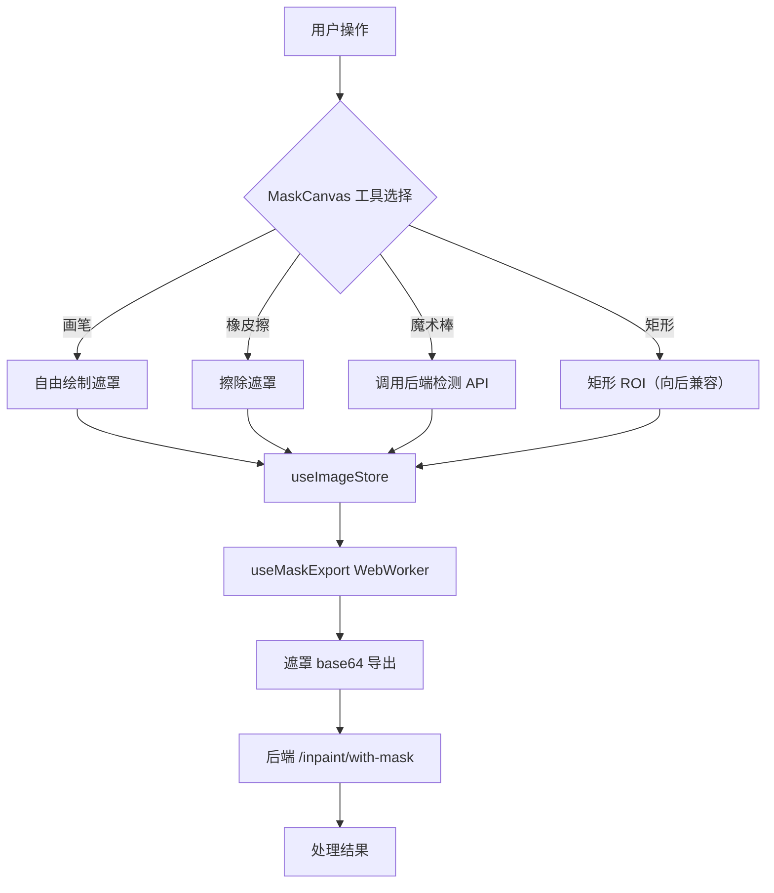

## 产品概述

为 HiImage 设计并实现低 CPU 占用的自由画笔绘制工具，用于去水印、替换背景、智能合成等场景中的遮罩绘制。当前系统仅支持矩形 ROI 绘制（ImageCanvas.tsx 使用原生 Canvas API），需升级为支持自由绘制遮罩的专业画笔工具。

## 核心功能

- **画笔绘制**：支持自由绘制遮罩区域，可调节画笔大小和硬度/羽化程度
- **橡皮擦工具**：擦除遮罩区域，支持大小独立调节
- **笔尖形状切换**：圆形/方形笔尖切换
- **魔术棒工具**：自动识别边缘，一键生成遮罩区域（调用后端 `/api/detect`）
- **遮罩管理**：支持撤销、删除、清除遮罩区域，撤销栈限制 20 步
- **实时预览**：绘制过程中通过分层渲染实时显示遮罩效果，CPU 占用极低
- **导出遮罩**：将绘制的遮罩通过 WebWorker 导出为 PNG base64，发送给后端 `/inpaint/with-mask` 接口
- **向后兼容**：保留原有矩形 ROI 绘制模式，用户可通过工具切换按钮选择
- **键盘快捷键**：B（画笔）、E（橡皮擦）、W（魔术棒）、`[` `]`（调节大小）、Ctrl+Z（撤销）

## 技术栈选择

| 技术 | 选型 | 理由 |
| --- | --- | --- |
| Canvas 渲染库 | Konva.js + react-konva | README 已提及；轻量（~80KB）；图层系统清晰；react-konva 声明式集成 |
| 状态管理 | Zustand | 延续现有架构（useImageStore） |
| UI 组件 | Tailwind CSS + 自定义组件 | 延续现有架构（components/ui/） |
| 后端接口 | `/api/inpaint/with-mask` | 后端已支持遮罩接口 |
| 多线程导出 | WebWorker | 遮罩导出放入 Worker，不阻塞主线程 |


**不使用 Fabric.js 的理由**：体积大（~170KB），且项目 README 已规划 Konva.js。

**不使用原生 Canvas API 扩展的理由**：自由绘制需大量底层逻辑（路径记录、撤销/重做、羽化算法），Konva 已内置 `Line` 绘制功能。

## 实施方案

### 核心策略：Konva.js 图层系统 + 多重性能优化

采用 **分层渲染架构**，通过 10 项优化手段确保 CPU 占用极低：

```
Konva Stage
├── Layer 1: 图像层（静态，仅图片变化时重绘）
├── Layer 2: 遮罩绘制层（动态，仅笔划变化时重绘，使用 batchDraw）
└── Layer 3: ROI 矩形层（可选，向后兼容）
```

### 性能优化策略详解（关键）

#### 优化 1：分层渲染（Layer Separation）

- **策略**：将图像层与遮罩层分离为独立的 Konva Layer
- **效果**：图像层仅在图片变化时重绘，遮罩层仅在笔划变化时重绘
- **实现**：
- 图像层：仅在 `imageSrc` 变化时重绘
- 遮罩层：仅在 `strokes` 变化时通过 `layer.batchDraw()` 重绘

#### 优化 2：点采样降频（Adaptive Point Sampling）

- **策略**：绘制时根据画笔大小自适应采样，避免过量数据点
- **算法**：计算当前点与上一个点的距离，仅当距离 > `brushSize / 3` 时记录新点
- **效果**：减少 3-5x 的点数据量，提升渲染性能
- **实现**：

```typescript
const shouldAddPoint = (x: number, y: number, lastPoint: Point, brushSize: number): boolean => {
  const dist = Math.sqrt((x - lastPoint.x) ** 2 + (y - lastPoint.y) ** 2);
  return dist > brushSize / 3;
};
```

#### 优化 3：requestAnimationFrame 节流

- **策略**：mousemove 事件使用 requestAnimationFrame 节流
- **效果**：确保每帧最多处理一次鼠标移动，避免超额渲染
- **实现**：

```typescript
const rafRef = useRef<number | null>(null);
const pendingMoveRef = useRef<Point | null>(null);

const handleMouseMove = (e: React.MouseEvent) => {
  pendingMoveRef.current = getCanvasPoint(e);
  if (rafRef.current === null) {
    rafRef.current = requestAnimationFrame(() => {
      const point = pendingMoveRef.current;
      if (point) processDraw(point);
      rafRef.current = null;
    });
  }
};
```

#### 优化 4：Konva batchDraw()

- **策略**：使用 `layer.batchDraw()` 替代多次 `layer.draw()`
- **效果**：批量重绘，避免每个笔划点触发一次重绘
- **实现**：在 mouseup 或添加多点后统一调用 `layer.batchDraw()`

#### 优化 5：OffscreenCanvas 羽化（优先）+ CSS 预览

- **策略**：
- 预览阶段：使用 CSS `filter: blur()` 实时显示羽化效果（零 CPU 开销）
- 导出阶段：使用 OffscreenCanvas 的 Gaussian Blur 生成最终羽化遮罩
- **效果**：预览零延迟，导出利用浏览器原生优化
- **回退**：若不支持 OffscreenCanvas，则使用常规 Canvas

#### 优化 6：WebWorker 遮罩导出

- **策略**：将遮罩层导出 base64 的操作放入 WebWorker
- **效果**：避免阻塞 UI 线程，保持界面流畅
- **实现**：创建 `maskExport.worker.ts`，主线程通过 `postMessage` 发送图层数据，Worker 返回 base64 字符串

#### 优化 7：React.memo 渲染优化

- **策略**：MaskCanvas 用 `React.memo` 包裹，自定义比较函数
- **效果**：避免无关状态变化导致重渲染
- **实现**：

```typescript
const MaskCanvas = React.memo(({ imageSrc, strokes, brushSettings }) => {
  // ...
}, (prev, next) => {
  return prev.imageSrc === next.imageSrc &&
         prev.strokes === next.strokes &&
         prev.brushSettings.size === next.brushSettings.size &&
         prev.brushSettings.tool === next.brushSettings.tool;
});
```

#### 优化 8：图像缩小预处理

- **策略**：导出遮罩时若图像超过 2048px（任一维度），先缩小再处理
- **效果**：减少内存占用和导出时间
- **实现**：检查图像尺寸，超过阈值则缩小到 2048px 以内

#### 优化 9：撤销栈限制

- **策略**：最多保留 20 步撤销历史
- **效果**：避免内存泄漏，控制内存占用
- **实现**：在 `addStroke` 时检查栈大小，超出则移除最早的记录

#### 优化 10：被动事件监听

- **策略**：鼠标事件监听使用 `{ passive: true }`（适用场景）
- **效果**：减少事件处理延迟
- **注意**：需要调用 `preventDefault()` 的场景（如滚轮缩放）不能使用 passive

### 数据流设计

```
用户绘制遮罩（MaskCanvas，点采样优化 + rAF 节流）
    ↓
Konva 图层更新（仅遮罩层 batchDraw）
    ↓
useImageStore.addMaskStroke(stroke)
    ↓
用户点击"去除水印"
    ↓
useMaskExport hook（WebWorker 导出 base64）
    ↓
API 调用：/api/inpaint/with-mask（优先）或 /api/inpaint（回退）
    ↓
后端 Inpainter 处理（支持 mask 参数）
```

## 架构设计

### 系统架构图



### 模块划分

| 模块 | 职责 | 性能要点 |
| --- | --- | --- |
| MaskCanvas 组件 | 遮罩绘制和显示，Konva 图层管理 | 分层渲染、点采样、rAF 节流 |
| MaskToolbar 组件 | 画笔工具切换和参数调节 UI | React.memo 避免重渲染 |
| useImageStore | 管理遮罩数据、画笔设置、撤销栈 | 撤销栈限制 20 步 |
| useMaskExport hook | 遮罩导出逻辑（WebWorker） | Worker 线程，不阻塞主线程 |
| maskExport.worker.ts | WebWorker 脚本，处理 Canvas → base64 | 离屏处理 |
| API 层 | 调用后端遮罩处理接口 | 优先 mask，回退 rois |


## 目录结构

```
frontend/src/renderer/
├── components/
│   ├── MaskCanvas.tsx          [NEW] 基于 Konva 的遮罩绘制画布，分层渲染 + 点采样优化
│   ├── MaskToolbar.tsx         [NEW] 画笔工具栏（大小、硬度、形状、魔术棒、撤销）
│   └── ImageCanvas.tsx         [MODIFY] 保留矩形 ROI 功能，新增工具切换按钮
├── stores/
│   └── useImageStore.ts        [MODIFY] 新增遮罩相关状态和方法（maskStrokes、brushSettings、undo 等）
├── types/
│   └── mask.ts                [NEW] 遮罩相关类型定义（MaskStroke、BrushSettings、MaskPoint）
├── hooks/
│   └── useMaskExport.ts       [NEW] 遮罩导出 hook（通过 WebWorker 导出 base64）
├── workers/
│   └── maskExport.worker.ts   [NEW] WebWorker 处理遮罩导出（Canvas → base64 PNG）
└── pages/
    ├── WatermarkRemoval.tsx    [MODIFY] 集成 MaskCanvas，优先使用遮罩模式调用 API
    └── SmartSynthesis.tsx     [MODIFY] 集成 MaskCanvas（精准替换模式）
```

## 关键代码结构

### types/mask.ts

```typescript
/** 遮罩笔划中的单个点坐标 */
export interface MaskPoint {
  x: number;
  y: number;
}

/** 单条遮罩笔划（支持画笔/橡皮擦，记录完整绘制参数） */
export interface MaskStroke {
  id: string;
  points: number[];        // 扁平化存储 [x1, y1, x2, y2, ...]，减少内存占用
  size: number;             // 画笔/橡皮擦大小（像素）
  hardness: number;          // 硬度/羽化 0-100
  shape: 'circle' | 'square';
  tool: 'brush' | 'eraser';
  timestamp: number;
}

/** 画笔/橡皮擦设置 */
export interface BrushSettings {
  size: number;             // 1-100
  hardness: number;          // 0-100（0=完全羽化，100=硬边）
  shape: 'circle' | 'square';
  tool: 'brush' | 'eraser' | 'magicWand';
}

/** 遮罩导出选项 */
export interface MaskExportOptions {
  format: 'png' | 'jpeg';
  quality: number;           // 0-1，仅 jpeg 有效
  maxDimension: number;      // 最大尺寸，默认 2048
}
```

### 新增 useImageStore 状态和方法

```typescript
// 新增状态
interface ImageState {
  // 现有状态...

  // 遮罩相关
  maskStrokes: MaskStroke[];
  brushSettings: BrushSettings;
  maskDataURL: string | null;
  canvasTool: 'rectangle' | 'brush';  // 工具切换

  // 新增方法
  setBrushSettings: (settings: Partial<BrushSettings>) => void;
  addMaskStroke: (stroke: MaskStroke) => void;
  undoMaskStroke: () => void;
  clearMaskStrokes: () => void;
  setMaskDataURL: (url: string | null) => void;
  setCanvasTool: (tool: 'rectangle' | 'brush') => void;
}
```

### MaskCanvas 核心接口

```typescript
interface MaskCanvasProps {
  imageSrc: string | null;
  strokes: MaskStroke[];
  brushSettings: BrushSettings;
  canvasTool: 'rectangle' | 'brush';
  onStrokeComplete: (stroke: MaskStroke) => void;
  onUndo: () => void;
}
```

### useMaskExport Hook 接口

```typescript
interface UseMaskExportReturn {
  exportMask: (
    strokes: MaskStroke[],
    imageWidth: number,
    imageHeight: number
  ) => Promise<string>;
  isExporting: boolean;
}
```

## 设计风格

采用 **深色主题 + 专业工具感** 设计风格，与现有 HiImage 的暗色主题（#1a1a1a 背景）保持完全一致。画笔工具栏设计参考 Photoshop/GIMP 等专业图像编辑软件，确保用户使用熟悉感。

## 页面布局设计

### 1. 画布区域（MaskCanvas）

- **位置**：主内容区域，占据页面大部分空间
- **背景**：深灰色（#1a1a1a），与现有 ImageCanvas 一致
- **交互**：
- 画笔模式：鼠标变为圆形光标，实时显示画笔大小预览（通过 CSS border-radius 实现，零 CPU 开销）
- 橡皮擦模式：鼠标变为方形光标
- 空格键：临时切换为平移模式（与现有逻辑一致，通过 useEffect 监听 keydown/keyup）
- 滚轮：缩放画布（与现有逻辑一致，使用 wheel 事件）

### 2. 画笔工具栏（MaskToolbar）

- **位置**：画布底部居中，浮动显示（类似现有工具栏，绝对定位 bottom-3 left-1/2 -translate-x-1/2）
- **样式**：
- 深灰色半透明背景（rgba(30, 30, 30, 0.95)）
- 圆角 8px，轻微阴影（shadow-lg）
- 按钮尺寸 32x32px，选中状态高亮显示（bg-bg-active text-fg-accent）
- 分隔线：w-px bg-border-subtle mx-0.5
- **布局**（从左到右）：

1. 矩形工具按钮（Square icon）- 切换回矩形 ROI 模式
2. 画笔工具按钮（Brush icon）- 切换到画笔模式
3. 橡皮擦工具按钮（Eraser icon）- 切换到橡皮擦模式
4. 分隔线
5. 画笔大小滑块（1-100px，带数值显示）
6. 硬度/羽化滑块（0-100，实时预览用 CSS filter: blur）
7. 笔尖形状切换按钮（圆形 Circle / 方形 Square icon）
8. 分隔线
9. 魔术棒按钮（Wand icon）
10. 撤销按钮（Undo icon，Ctrl+Z）

### 3. 右侧控制面板

- **保留现有布局**（w-[240px] bg-bg-secondary border-l border-border-subtle）
- **新增"绘制模式"切换**：
- 选项卡样式：`矩形 ROI` | `画笔绘制`
- 选择"画笔绘制"时，显示遮罩列表（类似现有 ROI 列表）

### 4. 遮罩列表（右侧面板）

- **位置**：右侧控制面板顶部，水印区域 section 下方
- **样式**：
- 每个遮罩项显示：编号、大小（px）、删除按钮
- 选中状态：蓝色高亮（bg-bg-active text-fg-accent）
- **交互**：点击选中遮罩，按 Delete 键删除

## 交互设计

### 画笔绘制交互

1. **选择画笔工具** → 鼠标变为画笔光标（通过 CSS cursor + 动态伪元素实现预览）
2. **在画布上拖拽** → 实时绘制遮罩（半透明绿色，rgba(76, 175, 80, 0.3)）
3. **调节画笔大小** → 使用滑块或键盘快捷键（`[` 减小，`]` 增大，步长 5px）
4. **调节硬度** → 使用滑块，预览通过 CSS filter: blur() 实现（零 CPU 开销）

### 橡皮擦交互

1. **选择橡皮擦工具** → 鼠标变为橡皮擦光标
2. **在遮罩上拖拽** → 擦除遮罩区域（通过 globalCompositeOperation = 'destination-out' 实现）
3. **支持大小调节** → 与画笔独立，快捷键同样适用

### 魔术棒交互

1. **点击魔术棒按钮** → 鼠标变为十字光标
2. **点击图像区域** → 调用后端 `/api/detect`（sensitivity 使用设置页的值），返回区域自动转为遮罩笔划
3. **支持多区域** → 每次点击追加新遮罩笔划

### 键盘快捷键

| 快捷键 | 功能 |
| --- | --- |
| `B` | 切换到画笔工具 |
| `E` | 切换到橡皮擦工具 |
| `W` | 切换到魔术棒工具 |
| `[` | 减小画笔/橡皮擦大小（步长 5px） |
| `]` | 增大画笔/橡皮擦大小（步长 5px） |
| `Ctrl+Z` | 撤销上一笔 |
| `Space` | 临时切换为平移模式（按下期间） |
| `Delete` | 删除选中遮罩 |


## 响应式设计

- **画布区域**：自适应窗口大小（已有 ResizeObserver，无需修改）
- **工具栏**：宽度自适应，小屏幕下自动调整间距
- **右侧面板**：宽度固定 240px（已有），内容滚动（overflow-y-auto）

## 视觉细节

| 元素 | 颜色 |
| --- | --- |
| 遮罩填充 | rgba(76, 175, 80, 0.3) |
| 遮罩边框 | #4caf50 |
| 橡皮擦预览 | rgba(244, 67, 54, 0.3) |
| 选中状态 | #007acc（与现有一致） |
| 禁用状态 | opacity: 0.5 |
| 工具栏背景 | rgba(30, 30, 30, 0.95) |


## Agent Extensions

### SubAgent

- **code-explorer**
- Purpose: 在实施方案时深入探索相关代码文件，确保修改准确性
- Expected outcome: 获取所有需要修改的文件的完整内容和依赖关系