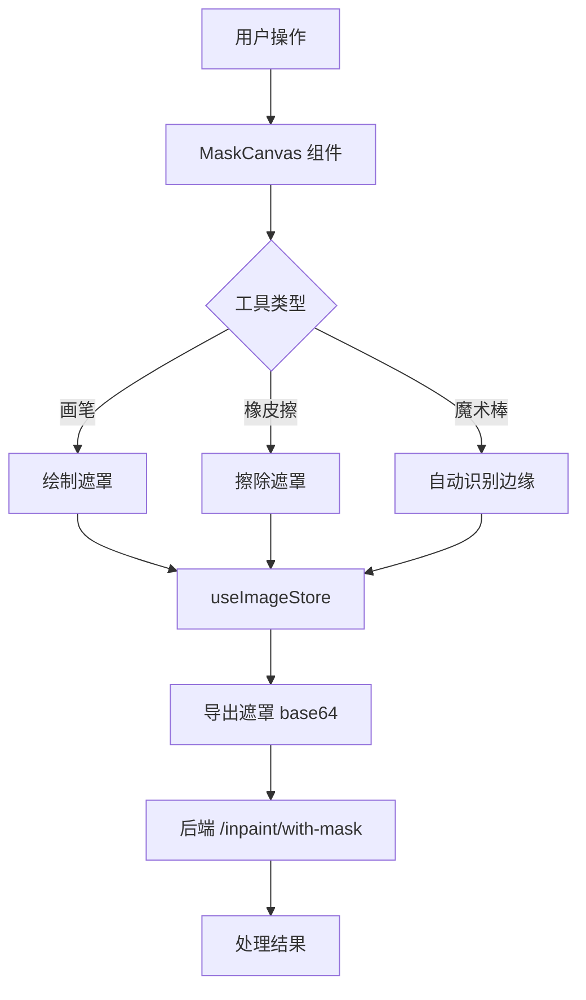

## 产品概述

为 HiImage 设计一个功能完整的画笔绘制工具，用于去水印、替换背景、智能合成等场景中的遮罩绘制。当前系统仅支持矩形 ROI 绘制，需要升级为支持自由绘制遮罩的专业画笔工具。

## 核心功能

- **画笔绘制**：支持自由绘制遮罩区域，可调节画笔大小和硬度/羽化程度
- **橡皮擦工具**：擦除遮罩区域，支持大小调节
- **笔尖形状切换**：圆形/方形笔尖切换
- **魔术棒工具**：自动识别边缘，一键生成遮罩区域
- **遮罩管理**：支持撤销、删除、清除遮罩区域
- **实时预览**：绘制过程中实时显示遮罩效果
- **导出遮罩**：将绘制的遮罩导出为 PNG base64 格式，发送给后端 `/inpaint/with-mask` 接口
- **向后兼容**：保留原有矩形 ROI 绘制模式，用户可切换工具

## 技术栈选择

- **Canvas 渲染库**：Konva.js + react-konva（README 已提及，原生支持自由绘制）
- **状态管理**：Zustand（延续现有架构）
- **UI 组件**：Tailwind CSS + Lucide React（延续现有架构）
- **后端接口**：复用现有 `/api/inpaint/with-mask` 接口

## 实施方法

### 核心策略

采用 **Konva.js 图层系统** 实现遮罩绘制：

1. **底层**：显示原图（Konva Image）
2. **中间层**：遮罩绘制层（Konva Line + Circle，自由绘制）
3. **顶层**：矩形 ROI 层（保留原有功能）

### 关键技术决策

1. **为什么选择 Konva.js 而非 Fabric.js？**

- Konva.js 更轻量（~80KB vs ~170KB）
- react-konva 与 React 集成更自然（声明式）
- 项目 README 已将其列为画布方案，符合原有规划

2. **为什么不用原生 Canvas API 扩展？**

- 自由绘制需要大量底层逻辑（路径记录、撤销/重做、羽化算法）
- Konva 已内置 `Line` 的绘制功能，便于实现自由绘制

3. **遮罩数据结构设计**

- 新增 `MaskStroke` 类型：`{ id, points, size, hardness, shape, tool }`
- 存储为 Konva Line 对象的序列化数据，便于撤销/重做
- 导出时：将遮罩层导出为 PNG base64

### 性能优化

- **按需渲染**：只有遮罩层变化时才重绘，使用 Konva 的 `batchDraw()`
- **点采样优化**：绘制时每 2-3 像素记录一个点，避免过多数据点
- **羽化实现**：使用离屏 Canvas 生成羽化遮罩，通过 Gaussian Blur 实现

### 数据流设计

```
用户绘制遮罩
    ↓
MaskCanvas 组件（Konva）
    ↓
useImageStore.updateMaskData(maskBase64)
    ↓
WatermarkRemoval/SmartSynthesis 页面
    ↓
API 调用：/api/inpaint/with-mask
    ↓
后端 Inpainter 处理
```

## 实施细节

### 1. 依赖安装

```
cd frontend && npm install konva react-konva
```

### 2. 新增类型定义

在 `frontend/src/renderer/types/` 新增 `mask.ts`：

- `MaskPoint`: 点坐标接口
- `MaskStroke`: 笔划数据接口（id, points, size, hardness, shape, tool）
- `BrushSettings`: 画笔设置接口（size, hardness, shape, tool）

### 3. 新增 MaskCanvas 组件

创建 `frontend/src/renderer/components/MaskCanvas.tsx`：

- 使用 `Stage`, `Layer`, `Image`, `Line` 组件
- 实现自由绘制逻辑（onMouseDown → onMouseMove → onMouseUp）
- 支持画笔/橡皮擦切换
- 实现魔术棒工具（调用后端 `/api/detect` 接口）

### 4. 更新 useImageStore

新增遮罩相关状态：

- `maskStrokes: MaskStroke[]`
- `brushSettings: BrushSettings`
- `maskDataURL: string | null`

新增方法：

- `setBrushSettings(settings)`
- `addMaskStroke(stroke)`
- `undoMaskStroke()`
- `clearMaskStrokes()`
- `exportMask()` - 导出遮罩为 base64

### 5. 更新 API 调用

修改 `useBackendAPI.ts` 的 `inpaint` 和 `runPipeline` 方法：

- 优先使用 `mask` 参数（如果存在遮罩）
- Fallback 到 `rois` 参数（如果只有矩形 ROI）

### 6. 工具栏 UI

在 `WatermarkRemoval.tsx` 和 `SmartSynthesis.tsx` 中新增工具栏：

- 画笔/橡皮擦切换按钮
- 画笔大小滑块
- 硬度/羽化滑块
- 笔尖形状切换按钮
- 魔术棒按钮
- 撤销按钮

## 架构设计

### 系统架构图



### 模块划分

- **MaskCanvas 组件**：负责遮罩绘制和显示
- **MaskToolbar 组件**：提供画笔工具切换和参数调节
- **useImageStore**：管理遮罩数据和画笔设置
- **useMaskExport hook**：处理遮罩导出逻辑
- **API 层**：调用后端遮罩处理接口

## 目录结构

```
frontend/src/renderer/
├── components/
│   ├── MaskCanvas.tsx          [NEW] 基于 Konva 的遮罩绘制画布
│   ├── MaskToolbar.tsx         [NEW] 画笔工具栏（大小、硬度、形状、魔术棒）
│   └── ImageCanvas.tsx         [MODIFY] 保留矩形 ROI 功能，新增工具切换
├── stores/
│   └── useImageStore.ts        [MODIFY] 新增遮罩相关状态和方法
├── types/
│   └── mask.ts                [NEW] 遮罩相关类型定义
├── hooks/
│   └── useMaskExport.ts       [NEW] 遮罩导出 hook（Canvas → base64）
└── pages/
    ├── WatermarkRemoval.tsx    [MODIFY] 集成 MaskCanvas，优先使用遮罩模式
    └── SmartSynthesis.tsx     [MODIFY] 集成 MaskCanvas（精准替换模式）
```

## 设计风格

采用 **现代深色主题 + 专业工具感** 设计风格，与现有 HiImage 的暗色主题保持一致。画笔工具栏设计参考 Photoshop/GIMP 等专业图像编辑软件，确保用户体验的熟悉感。

## 页面布局设计

### 1. 画布区域（MaskCanvas）

- **位置**：主内容区域，占据页面大部分空间
- **背景**：深灰色（#1a1a1a），与现有 ImageCanvas 一致
- **交互**：
- 画笔模式：鼠标变为圆形光标，实时显示画笔大小预览
- 橡皮擦模式：鼠标变为方形光标
- 空格键：临时切换为平移模式（与现有逻辑一致）
- 滚轮：缩放画布（与现有逻辑一致）

### 2. 画笔工具栏（MaskToolbar）

- **位置**：画布底部居中，浮动显示（类似现有工具栏）
- **样式**：
- 深灰色半透明背景（rgba(30, 30, 30, 0.9)）
- 圆角 8px，轻微阴影
- 按钮尺寸 32x32px，选中状态高亮显示
- **布局**（从左到右）：

1. 画笔工具按钮（Brush icon）
2. 橡皮擦工具按钮（Eraser icon）
3. 分割线
4. 画笔大小滑块（带数值显示，范围 1-100px）
5. 硬度/羽化滑块（范围 0-100）
6. 笔尖形状切换（圆形/方形 icon）
7. 分割线
8. 魔术棒按钮（Wand icon）
9. 撤销按钮（Undo icon）

### 3. 右侧控制面板

- **保留现有布局**，新增"绘制模式"切换：
- 选项卡：`矩形 ROI` | `画笔绘制`
- 选择"画笔绘制"时，显示遮罩列表（类似现有 ROI 列表）

### 4. 遮罩列表

- **位置**：右侧控制面板顶部
- **样式**：
- 每个遮罩项显示：编号、大小、删除按钮
- 选中状态：蓝色高亮
- 鼠标悬停：显示遮罩预览缩略图

## 交互设计

### 画笔绘制交互

1. **选择画笔工具** → 鼠标变为画笔光标
2. **在画布上拖拽** → 实时绘制遮罩（半透明绿色）
3. **调节画笔大小** → 使用滑块或键盘快捷键（`[` 减小，`]` 增大）
4. **调节硬度** → 使用滑块，实时预览羽化效果

### 橡皮擦交互

1. **选择橡皮擦工具** → 鼠标变为橡皮擦光标
2. **在遮罩上拖拽** → 擦除遮罩区域
3. **支持大小调节** → 与画笔独立

### 魔术棒交互

1. **点击魔术棒按钮** → 鼠标变为十字光标
2. **点击图像区域** → 自动识别相似颜色区域，生成遮罩
3. **调节敏感度** → 弹出滑块（类似现有检测敏感度）

### 键盘快捷键

- `B` - 切换到画笔工具
- `E` - 切换到橡皮擦工具
- `W` - 切换到魔术棒工具
- `[` - 减小画笔/橡皮擦大小
- `]` - 增大画笔/橡皮擦大小
- `Ctrl+Z` - 撤销上一笔
- `Space` - 临时切换为平移模式

## 响应式设计

- **画布区域**：自适应窗口大小（已有 ResizeObserver）
- **工具栏**：小屏幕下自动折叠为图标，点击展开
- **右侧面板**：宽度固定 240px（已有），内容滚动

## 视觉细节

- **遮罩颜色**：半透明绿色（rgba(76, 175, 80, 0.3)），边框绿色（#4caf50）
- **橡皮擦预览**：半透明红色圆圈（rgba(244, 67, 54, 0.3)）
- **选中状态**：蓝色高亮（#007acc），与现有选中逻辑一致
- **禁用状态**：透明度 0.5，不允许点击